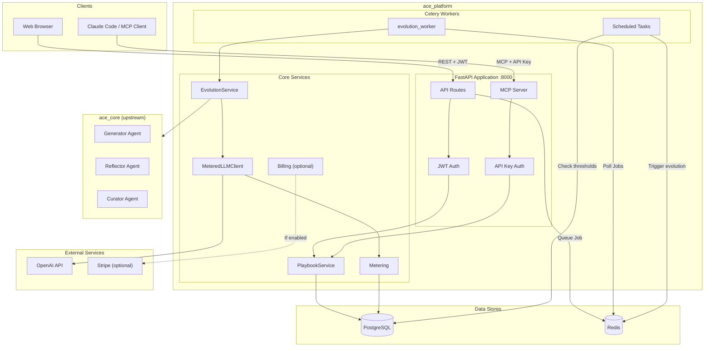
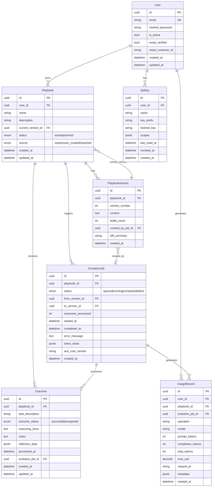
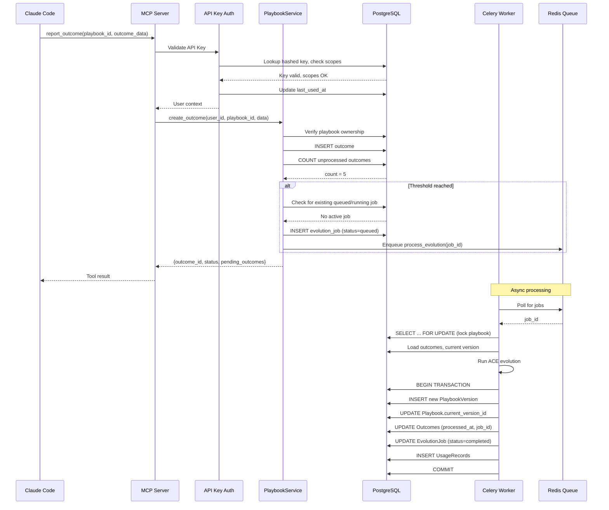
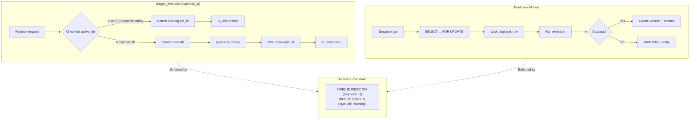
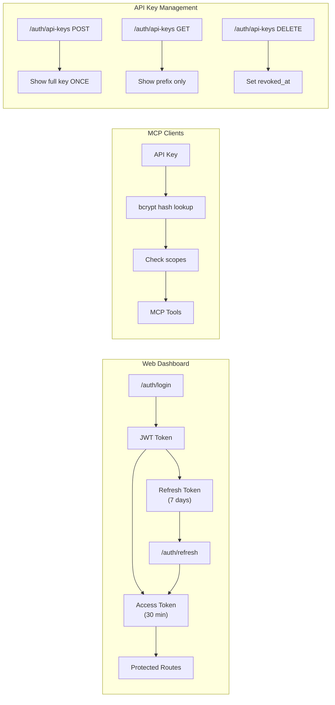
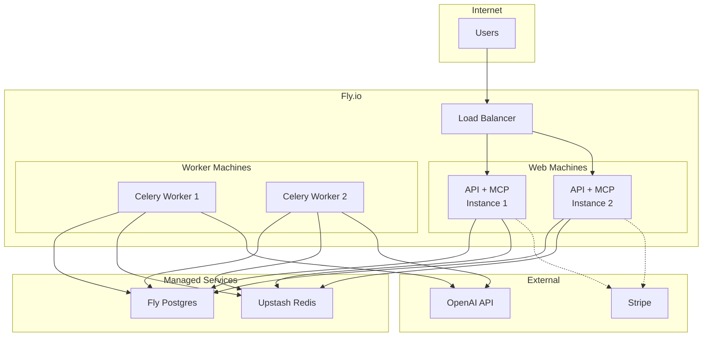

# ACE Platform Architecture

## High-Level Overview



## Data Model



## Request Flow: MCP Tool Call



## Evolution Concurrency Control



## Authentication Flow



## Directory Structure

```
ace-platform/
├── ace_core/                    # Upstream ACE (Generator, Reflector, Curator)
│   ├── ace/
│   │   ├── core/
│   │   │   ├── generator.py
│   │   │   ├── reflector.py
│   │   │   └── curator.py
│   │   └── ace.py
│   ├── llm.py
│   └── playbook_utils.py
│
├── ace_platform/                # Hosted platform layer
│   ├── api/
│   │   ├── main.py              # FastAPI app entry
│   │   ├── deps.py              # Dependency injection
│   │   ├── middleware.py        # Logging, rate limiting, correlation IDs
│   │   ├── routes/
│   │   │   ├── auth.py          # JWT + API key endpoints
│   │   │   ├── playbooks.py     # CRUD + versions + outcomes
│   │   │   └── billing.py       # Stripe (optional)
│   │   └── schemas/             # Pydantic request/response models
│   │
│   ├── mcp/
│   │   ├── server.py            # MCP server entry
│   │   ├── tools.py             # 5 MCP tools
│   │   └── auth.py              # API key middleware
│   │
│   ├── core/
│   │   ├── playbooks.py         # Business logic
│   │   ├── evolution.py         # Wraps ace_core
│   │   ├── llm_proxy.py         # Metered OpenAI client
│   │   ├── metering.py          # Usage tracking
│   │   ├── billing.py           # Stripe (optional)
│   │   ├── security.py          # Rate limiting, validation
│   │   ├── logging.py           # Structured JSON logging
│   │   └── metrics.py           # Basic metrics
│   │
│   ├── db/
│   │   ├── models.py            # SQLAlchemy models
│   │   ├── session.py           # Async + Sync session factories
│   │   └── migrations/          # Alembic
│   │
│   ├── workers/
│   │   ├── celery_app.py        # Celery config
│   │   └── evolution_worker.py  # Background tasks
│   │
│   └── config.py                # Pydantic Settings
│
├── web/
│   ├── templates/               # Jinja2 templates
│   └── static/                  # CSS, JS
│
├── playbooks/                   # Starter playbooks
├── tests/
├── docs/
├── docker-compose.yml
├── Dockerfile
└── fly.toml
```

## Deployment Architecture



## Key Design Decisions

| Decision | Choice | Rationale |
|----------|--------|-----------|
| Web Framework | FastAPI | Async support, auto OpenAPI docs, Pydantic integration |
| Database | PostgreSQL | JSONB for flexible fields, partial indexes, transactions |
| Task Queue | Celery + Redis | Mature, reliable, good monitoring |
| Web Tier DB | AsyncSession (asyncpg) | High concurrency for I/O-bound API calls |
| Worker DB | Sync Session (psycopg2) | Simpler for CPU-bound evolution tasks |
| Web Auth | JWT (access + refresh) | Stateless, standard for web apps |
| MCP Auth | Hashed API Keys | Simple for programmatic access, revocable |
| Frontend | Jinja2 Templates | Faster MVP than React SPA |
| Versioning | Immutable PlaybookVersion | Full history, easy rollback, audit trail |
| Concurrency | Partial unique index | Database-enforced single active evolution |
| Billing | Feature-flagged | Optional for self-hosted deployments |
